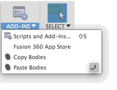

#Copy / Paste Bodies Utility for Autodesk Fusion 360

This utility allows you to select multiple bodies across multiple components and copy them into a new component.

It is intentionally __NOT__ a parametric copy and the new body has no parents in the document and is independant of the original bodies.

Note the target component __does not__ have to be in the same document.

Also the "clipboard" is persistant and paste will always bring in what ever the last copied body set on your current physical machine.

## Usage:
First see [How to install sample Add-Ins and Scripts](https://rawgit.com/AutodeskFusion360/AutodeskFusion360.github.io/master/Installation.html)

See a youtube video of using the script here: __TBD__

Start the addin from the addins menu. 
Under Addins you will now see buttons for copy and paste bodies 

###Copy Bodies
* Select Copy Bodies.
* You can now select multiple bodies, these can be across multiple components
* Select OK

###Paste Bodies
* Select Paste Bodies
* Select the target component, note this can be in a _different file_
* Select OK

Note: the copied bodies will all reside within a new base feature in the target component and are not ascociative to the original bodies:

## License
Samples are licensed under the terms of the [MIT License](http://opensource.org/licenses/MIT). Please see the [LICENSE](LICENSE) file for full details.

## Written by

Written by [Patrick Rainsberry](https://twitter.com/prrainsberry)   (Autodesk Fusion 360 Business Development)

See more useful [Fusion 360 Utilities](https://tapnair.github.io/index.html)

